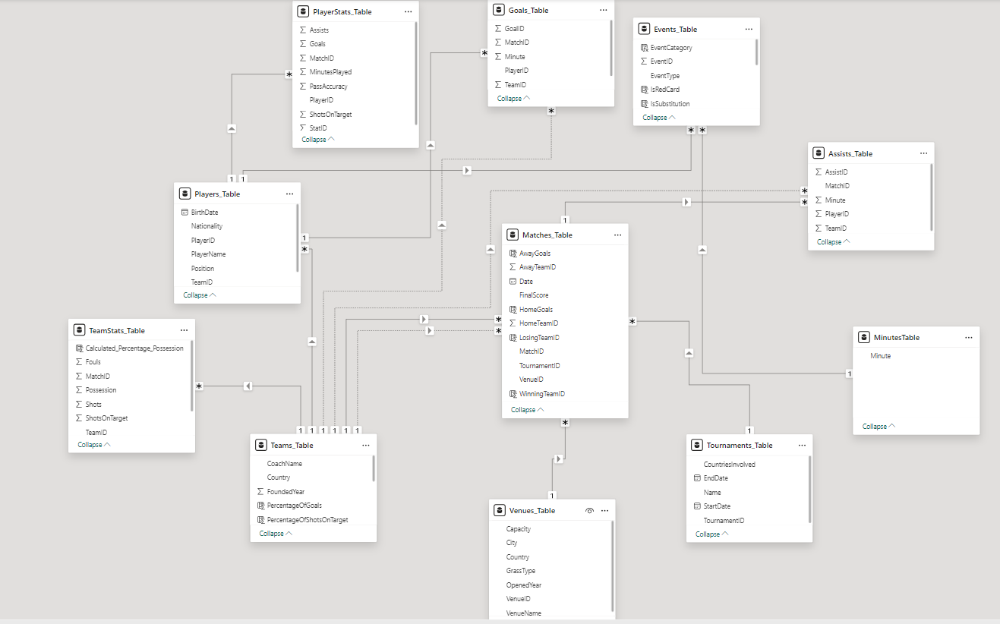
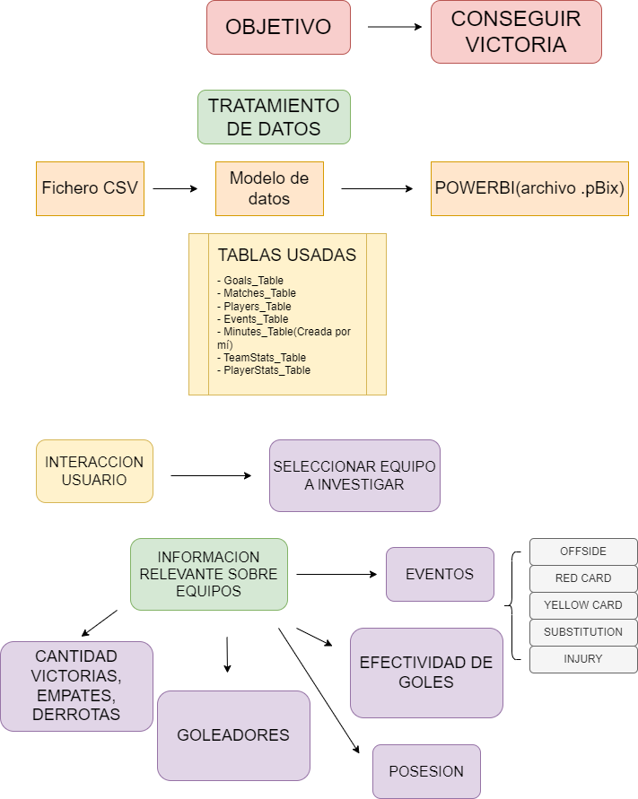
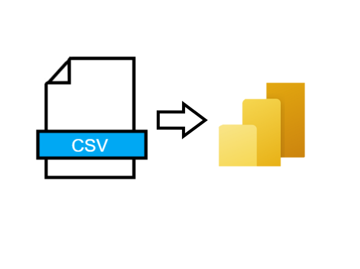

# Football Dashboard Project

## Table of Contents

[Introduction](#Introduction)

[Data Models](#Data-Models)

[Dashboard Mockup](#Dashboard-Mockup)

[Architecture Diagram](#Architecture-Diagram)

[References](#References)

## Introduction

This project involves the creation of a data analysis dashboard to provide insights from football metrics. The dashboard leverages Power BI for data visualization and analysis, offering a user-friendly interface for to explore data trends, actionable insights about footbal teams.

## Data Models

## Dashboard Mockup

Below is a conceptual mockup of the dashboard:

Data Loading and Transformation

The ETL (Extract, Transform, Load) process is crucial for preparing the data for analysis. The process involves:

## Data Extraction

Extract data from csv files

Data Transformation

Cleanse and normalize data.

Create calculated columns and measures in Power BI using DAX (Data Analysis Expressions).

## Architecture Diagram

The architecture diagram illustrates the data flow:

ETL Process: Data loading, transformation, and modeling in Power BI.

Power BI Dashboard: Visualization and reporting.

DAX (Data Analysis Expressions): Used for creating calculated columns, measures, and custom aggregations.

[Data Sources] --> [ETL Process] --> [Power BI Data Model] --> [Power BI Dashboard]

## References

Learning Resources:

Microsoft Power BI Documentation

DAX Guide

Youtube: 
<a href="https://www.youtube.com/watch?v=TXZfkgRhy3s&t=1983s" target="_blank">Tutoriales Dashboard PowerBI</a>

